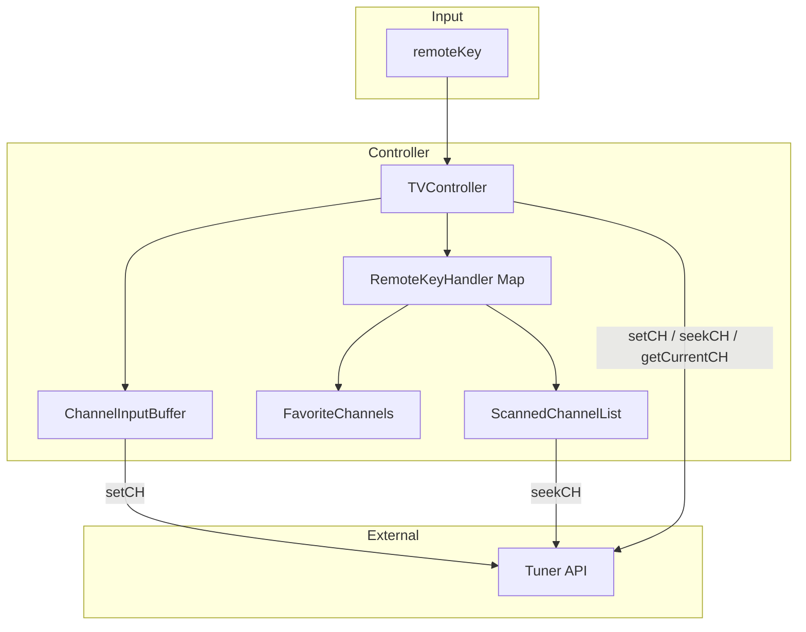

# TDD_TV_01 코드 품질 분석·리팩토링·구현 보고서

| 항목 | 내용 |
|------|------|
| 프로젝트 | TDD_TV_01 (TDD_TV Maven) |
| 작성자 | 김경림 |
| 작성일 | 2026-05-19 |
| 문서 유형 | 코드 품질 분석 · 리팩토링 · 기능 구현 통합 보고서 |
| 상세 산출물 | [`docs/02.code_quality_report.md`](../docs/02.code_quality_report.md) |
| 선행 문서 | [`REPORT/01.TDD_TV_01_요구사항분석_보고서.md`](01.TDD_TV_01_요구사항분석_보고서.md) |
| 저장소 | https://github.com/antihu99/TDD_TV_01.git |

---

## 1. 보고서 개요

본 문서는 `TVController` 모듈에 대해 수행한 **코드 품질 분석**, **SOLID/Code Smell 기반 리팩토링**, **README 요구사항 전 기능 구현** 및 **테스트 보강** 결과를 정리합니다.

| 단계 | 내용 | 산출물 |
|------|------|--------|
| 1 | SOLID·Code Smell 분석 | `docs/02.code_quality_report.md` |
| 2 | 구조 리팩토링 (SRP/OCP, 버퍼·핸들러 분리) | `ChannelInputBuffer`, `RemoteKeyHandler` 등 |
| 3 | README TDD practice 전 기능 구현 | `TVController` + 협력 클래스 |
| 4 | 시나리오 테스트 17건 | `TVControllerTest` |

---

## 2. 작업 전·후 비교

### 2.1 구현 상태

| 구분 | 작업 전 | 작업 후 |
|------|---------|---------|
| `remoteKey` | `KEY_1`, `KEY_OK` | `KEY_0`~`KEY_9`, `KEY_OK`, 업/다운, 검색, 선호 키 |
| `tuner.setCH` | 주석 처리, `System.out`만 출력 | 모든 채널 변경 경로에서 호출 |
| 숫자 입력 | `KEY_1`만 case 처리 | 0~9 공통 처리, 2자리 자동 확정 |
| 선호 채널 | 미구현 | 토글·다음 선호 |
| 채널 검색 | 미구현 | `seekCH()` 반복·목록 저장 |
| 업/다운 | 미구현 | 검색 유무 분기 (±1 순환 / 목록 탐색) |
| `TVControllerTest` | 스켈레톤 1건 | **17건 Green** (규칙 ID 기반) |

### 2.2 소스 구조 (작업 후)

```
src/main/java/com/bestreviewer/
├── TVController.java          # 리모컨 이벤트 디스패치
├── ChannelInputBuffer.java    # 숫자 버퍼·2자리 자동 확정
├── ChannelConstants.java      # 채널 0~99 상수·검증
├── FavoriteChannels.java      # 선호 채널 토글·다음 선호
├── ScannedChannelList.java    # 검색 목록·목록 기준 업/다운
├── RemoteKeyHandler.java      # 키 처리 확장 인터페이스
├── remoteKey.java             # 리모컨 키 enum
└── Tuner.java                 # 외부 API (미변경)

src/test/java/com/bestreviewer/
└── TVControllerTest.java      # 17 시나리오 (Mockito)
```

---

## 3. 코드 품질 분석 요약

상세 표는 [`docs/02.code_quality_report.md`](../docs/02.code_quality_report.md) 참조.

### 3.1 주요 문제점 및 조치

| 문제점 | 원칙/스멜 | 조치 결과 |
|--------|-----------|-----------|
| `tuner.setCH` 미호출, 로그만 출력 | SRP 위반, Incomplete | `applyChannel()` 단일 경로로 통합, 로그 제거 |
| `switch` + `KEY_1`만 | OCP 위반, Duplicated Code 예상 | 숫자 `isDigitKey()` 공통 처리 + `EnumMap` 핸들러 |
| 버퍼·튜너·선호·검색 한 클래스 집중 | God Class 예상 | `ChannelInputBuffer`, `FavoriteChannels`, `ScannedChannelList` 분리 |
| 채널 0~99 미정의 | Magic Number | `ChannelConstants.MIN/MAX_CHANNEL` |
| `processingCH` 문자열 직접 관리 | Primitive Obsession | `ChannelInputBuffer` 캡슐화 |

### 3.2 리팩토링 우선순위 이행

| 순위 | 계획 | 이행 |
|:---:|------|------|
| 1 | `setCH` 연동, 로그 제거 | ✅ |
| 2 | 숫자 0~9 공통 처리 | ✅ |
| 3 | 채널 버퍼 추출 | ✅ `ChannelInputBuffer` |
| 4 | 키 핸들러 OCP 구조 | ✅ `RemoteKeyHandler` + `EnumMap` |
| 5 | 0~99 상수·검증 | ✅ `ChannelConstants` |

---

## 4. 구현 상세

### 4.1 숫자 채널 입력 (`ChannelInputBuffer`)

| 규칙 ID | 시나리오 | 구현 방식 |
|---------|----------|-----------|
| N-01 | `1` + 확인 → 1 | 1자리 버퍼 + `KEY_OK` → `setCH` |
| N-02 | `1`, `2` → 12 | 2자리 도달 시 자동 `setCH` |
| N-03 | `1`,`2`,`3`,`4` → 12, 34 | 2자리마다 flush, 나머지 자릿수 유지 |
| N-04 | `4`,`5`,`6` → 45 | 동일 (버퍼에 `6` 잔류) |
| N-05 | 이후 확인 → 6 | 1자리 버퍼 + `KEY_OK` |
| N-06 | 그 외 키 → 6 무효 | 비숫자·비확인 키 시 `channelBuffer.clear()` 후 동작 |
| N-07 | `0`, `7` → 7 | `"07"` 2자리 파싱 → 7 |

**핵심 로직**: 2자리가 쌓일 때마다 `flushCompletePairs()`로 유효 채널(0~99)이면 즉시 `onChannelReady` 콜백 → `tuner.setCH`.

### 4.2 채널 업/다운

| 모드 | 규칙 ID | 동작 |
|------|---------|------|
| 검색 목록 없음 | UD-01~04 | `current ± 1`, 99↔0 순환 (`wrapChannel`) |
| 검색 목록 있음 | UD-05~08 | 정렬 목록에서 다음/이전, 없으면 순환 |

### 4.3 채널 검색 (`ScannedChannelList`)

| 규칙 ID | 동작 |
|---------|------|
| S-01 | `getCurrentCH()` 기준으로 `seekCH()` 반복 호출, 이미 본 채널 재등장 시 종료, 목록 정렬 저장 |
| S-02 | 이후 업/다운은 저장 목록 기준 |

### 4.4 선호 채널 (`FavoriteChannels`)

| 규칙 ID | 동작 |
|---------|------|
| F-01, F-02 | `KEY_FAV_ADD` → `TreeSet` 토글 (추가/삭제) |
| P-01, P-02 | `KEY_FAV_NEXT` → `min { f > current }`, 없으면 `min(Favorites)` |

### 4.5 `remoteKey` 정의

| 키 | enum | 기능 |
|----|------|------|
| 0~9 | `KEY_0` ~ `KEY_9` | 숫자 입력 (`isDigitKey() == true`) |
| 확인 | `KEY_OK` | 버퍼 확정 |
| 채널 업/다운 | `KEY_CH_UP`, `KEY_CH_DOWN` | 채널 변경 |
| 채널 검색 | `KEY_SEARCH` | `seekCH` 스캔 |
| 선호 추가 | `KEY_FAV_ADD` | 선호 토글 |
| 다음 선호 | `KEY_FAV_NEXT` | 다음 선호 채널 |

### 4.6 `TVController.pushButton` 흐름

```
숫자 키?  → channelBuffer.appendDigit() → (2자리 시 자동 setCH)
KEY_OK?   → confirmChannelFromBuffer()
기타 키?  → channelBuffer.clear() → keyHandlers.get(key).handle()
```

---

## 5. 테스트 현황

### 5.1 `TVControllerTest` (17건, Green)

| 분류 | 테스트 수 | 검증 규칙 |
|------|:--------:|-----------|
| 숫자·확인 | 9 | N-01 ~ N-07, OK-02 |
| 업/다운 (검색 없음) | 4 | UD-01 ~ UD-04 (`@ParameterizedTest`) |
| 검색·목록 업/다운 | 3 | S-01, UD-05 ~ UD-08 |
| 선호 채널 | 2 | P-01, P-02 |

**검증 방식** (`.cursorrules` 준수)

- Given–When–Then 구조
- `@DisplayName` 한글 시나리오명
- `Mockito.verify(tuner).setCH(...)` — 로그 미사용
- 채널 상태 필요 시 `AtomicReference` + `stubChannelTracking()`

### 5.2 실행 결과

```bash
mvn test -Dtest=TVControllerTest
# Tests run: 17, Failures: 0, Errors: 0
```

### 5.3 `TunerTest` (참고)

`TunerTest`는 `mock(Tuner.class)` 스텁 미설정으로 다수 실패할 수 있습니다.  
본 모듈 TDD는 **`TVControllerTest` + Mock Tuner** 기준이며, Tuner 구현체 테스트는 요구사항상 작성 대상이 아닙니다.

---

## 6. 아키텍처 다이어그램



---

## 7. 요구사항 충족 매트릭스

| README 기능 | 규칙 ID | 구현 | 테스트 |
|-------------|---------|:----:|:------:|
| 숫자 버튼 채널 변경 | N-01 ~ N-07 | ✅ | ✅ |
| 선호 채널 추가 | F-01, F-02 | ✅ | (다음선호 테스트로 간접) |
| 다음 선호 채널 | P-01, P-02 | ✅ | ✅ |
| 채널 검색 | S-01 ~ S-03 | ✅ | ✅ |
| 업/다운 (검색 없음) | UD-01 ~ UD-04 | ✅ | ✅ |
| 업/다운 (검색 있음) | UD-05 ~ UD-08 | ✅ | ✅ |
| Tuner 연동 | C-03 | ✅ | ✅ |

---

## 8. 잔여 이슈·향후 작업

| 항목 | 설명 | 권장 |
|------|------|------|
| F-01/F-02 단독 테스트 | 선호 토글만 검증하는 테스트 없음 | 내부 상태 노출 없이 시나리오 테스트 추가 가능 |
| `9`,`9`+확인 → 99 | README 미명시 경계 | 요구 확정 후 ParameterizedTest 추가 |
| `pom.xml` Java 21 | `.cursorrules`와 pom 1.8 불일치 | 환경 통일 시 compiler 21·JaCoCo 설정 |
| `TunerTest` Green | Mock 스텁 보강 필요 | Controller TDD와 별도 정비 |
| `FakeTuner` | 저장소 참조만 존재 | 통합 테스트용 Fake 정비 (선택) |

---

## 9. 산출물 목록 (본 작업)

| 파일 | 설명 |
|------|------|
| `docs/02.code_quality_report.md` | SOLID·Code Smell 분석 상세 |
| `REPORT/02.TDD_TV_01_코드품질_구현_보고서.md` | 본 보고서 |
| `src/main/java/.../Channel*.java` 등 | 리팩토링·도메인 클래스 |
| `src/test/java/.../TVControllerTest.java` | 17 시나리오 테스트 |

---

## 10. 결론

`TVController`는 스켈레톤 상태에서 **README TDD practice 6개 기능 영역을 모두 구현**하였고, 코드 품질 분석에서 도출한 **SRP/OCP 개선·매직 넘버 제거·버퍼 캡슐화**를 반영했습니다.  
`TVControllerTest` 17건이 Green이며, 리모컨 키 입력부터 `Tuner.setCH` / `seekCH` 연동까지 요구사항 분석 문서의 규칙 ID(N-, UD-, S-, P-)와 추적 가능한 수준으로 정합되었습니다.

---

*문의·수정: `README.md`, `docs/01.requirements_analysis.md`, `docs/02.code_quality_report.md`, `.cursorrules` 참조*
