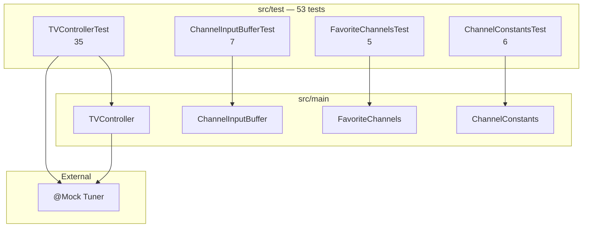

# TDD_TV_01 테스트 계획·구현 보고서

| 항목 | 내용 |
|------|------|
| 프로젝트 | TDD_TV_01 (TDD_TV Maven) |
| 작성자 | 김경림 |
| 작성일 | 2026-05-19 |
| 문서 유형 | 테스트 계획 수립 · 갭 테스트 구현 · JaCoCo 커버리지 통합 보고서 |
| 상세 산출물 | [`docs/03.test_plan.md`](../docs/03.test_plan.md) |
| 선행 문서 | [`REPORT/02.TDD_TV_01_코드품질_구현_보고서.md`](02.TDD_TV_01_코드품질_구현_보고서.md) |
| 저장소 | https://github.com/antihu99/TDD_TV_01.git |

---

## 1. 보고서 개요

본 문서는 시니어 QA 리드 관점의 **테스트 계획서** 작성, **JaCoCo Maven 플러그인** 적용, **갭(Gap) 단위 테스트** 구현 및 **`mvn verify` 커버리지 게이트** 통과 결과를 정리합니다.

| 단계 | 내용 | 산출물 |
|------|------|--------|
| 1 | 단위 테스트 범위·우선순위·경계값·예외 케이스 정의 | `docs/03.test_plan.md` |
| 2 | JaCoCo 0.8.12 + Surefire 설정 | `pom.xml` |
| 3 | 갭 시나리오 테스트 구현 (F-, P-, B-, X-) | 테스트 클래스 4종 |
| 4 | 커버리지 게이트 검증 | LINE ≥90%, BRANCH ≥85% |

---

## 2. 작업 전·후 비교

### 2.1 테스트·빌드 현황

| 구분 | 작업 전 (02 보고서 시점) | 작업 후 (본 보고서) |
|------|-------------------------|---------------------|
| 테스트 계획 문서 | 없음 | `docs/03.test_plan.md` |
| `TVControllerTest` | 17건 | **35건** |
| 협력 클래스 직접 테스트 | 없음 | `ChannelInputBufferTest`, `FavoriteChannelsTest`, `ChannelConstantsTest` |
| 총 단위 테스트 | 17건 | **53건** (Green) |
| JaCoCo | 미설정 | `prepare-agent` / `report` / `check` |
| `mvn verify` 커버리지 게이트 | 없음 | **통과** |
| `TunerTest` | 전체 `mvn test` 시 실패 | Surefire **제외** (Controller TDD와 분리) |

### 2.2 갭 해소 현황 (테스트 계획 §2.3 기준)

| 갭 항목 | 조치 | 검증 테스트 |
|---------|------|-------------|
| F-01/F-02 선호 토글 | ✅ | `TVControllerTest`, `FavoriteChannelsTest` |
| 0~9 단독 + 확인 | ✅ | `@ParameterizedTest` ×10 |
| `9`+`9` → 99, `9`+`8` → 98 | ✅ | `TVControllerTest`, `ChannelInputBufferTest` |
| 선호 없음 + `KEY_FAV_NEXT` | ✅ | P-04 |
| 선호 1개 로테이션 | ✅ | P-03 |
| `ChannelInputBuffer` 직접 테스트 | ✅ | `ChannelInputBufferTest` 7건 |
| `ChannelConstants.isValid` | ✅ | `ChannelConstantsTest` 6건 |
| 숫자 입력 중 선호추가 버퍼 클리어 | ✅ | X-01 |

---

## 3. 테스트 계획 요약

상세 매트릭스·경계값·JaCoCo 전략은 [`docs/03.test_plan.md`](../docs/03.test_plan.md) 참조.

### 3.1 단위 테스트 범위·우선순위

| 우선순위 | 영역 | 규칙 ID | 테스트 클래스 |
|----------|------|---------|---------------|
| **P0** | 숫자·확인, 2자리 자동 확정 | N-01~N-07, OK-01~02 | `TVControllerTest`, `ChannelInputBufferTest` |
| **P0** | 업/다운 (검색 없음) | UD-01~04 | `TVControllerTest` |
| **P1** | 채널 검색·목록 업/다운 | S-01~03, UD-05~08 | `TVControllerTest` |
| **P1** | 다음 선호 | P-01~P-03 | `TVControllerTest`, `FavoriteChannelsTest` |
| **P2** | 선호 토글·경계·교차 | F-01~02, B-*, X-* | `TVControllerTest` 등 |
| **Out** | `Tuner` 구현체 | — | Mock/Fake만 (구현 테스트 금지) |

### 3.2 경계값 테스트 (채널 0, 1, 98, 99)

| 경계 | 시나리오 | 구현 테스트 |
|------|----------|-------------|
| **0** | `KEY_0` + `OK` → `"0"` | `setChannelForSingleDigitWithOk(0)` |
| **1** | `KEY_1` + `OK` → `"1"` | N-01, Parameterized |
| **98** | `9`,`8` 연속 → `"98"` | `setChannel98WhenKey9AndKey8` |
| **99** | `9`,`9` 연속 → `"99"` | `setChannel99WhenKey9AndKey9` |
| **0↔99 순환** | ch=99 UP→0, ch=0 DOWN→99 | UD Parameterized |

### 3.3 예외·특이 케이스 (명세 고정)

| ID | 내용 | 테스트 결과 |
|----|------|-------------|
| OK-02 | 빈 버퍼 + `OK` → `setCH` 미호출 | ✅ |
| P-04 | 선호 없음 + `FAV_NEXT` → `setCH` 미호출 | ✅ (`getCurrentCH` 스텁 필요) |
| B-INV-01 | `1`,`0`,`0` → `10` 즉시 반영, 잔여 `0` 파싱 | ✅ (`ChannelInputBufferTest`) |
| X-01 | 숫자 버퍼 대기 중 `FAV_ADD` → 버퍼 클리어 | ✅ |

> **B-INV-01 해석**: `100`을 단일 채널로 파싱하지 않고, 2자리 단위로 `10` flush 후 남은 `0`만 1자리 버퍼로 유지하는 동작을 테스트로 고정했습니다.

---

## 4. JaCoCo 및 Maven 설정

### 4.1 `pom.xml` 추가 사항

| 플러그인 | 버전 | 역할 |
|----------|------|------|
| `jacoco-maven-plugin` | 0.8.12 | 커버리지 수집·리포트·게이트 |
| `maven-surefire-plugin` | 3.5.4 | JUnit 5, `TunerTest` 제외 |
| `maven-compiler-plugin` | 3.13.0 | Java 1.8 컴파일 (기존 유지) |

### 4.2 커버리지 목표 (`verify` 단계)

| 지표 | 목표 | 게이트 |
|------|------|--------|
| LINE | ≥ **90%** | `com.bestreviewer` 패키지 |
| BRANCH | ≥ **85%** | 동일 |
| 제외 | — | `com/bestreviewer/Tuner.class` (인터페이스) |

### 4.3 실행 명령

```bash
mvn clean test      # 테스트 + target/site/jacoco/index.html
mvn clean verify    # 테스트 + 커버리지 게이트 (CI 권장)
```

### 4.4 `TunerTest` 분리 정책

- `src/test/java/com/bestreviewer/TunnerTest.java` (클래스명 `TunerTest`)는 Mock **계약 예시**용입니다.
- 스텁 없이 실행 시 `NullPointerException` / assertion 실패가 발생할 수 있어, Surefire에서 **제외**했습니다.
- Controller 모듈 TDD의 **합격 기준**은 `mvn verify`(53건)입니다.

---

## 5. 테스트 클래스별 현황

### 5.1 테스트 수·분류

| 테스트 클래스 | 건수 | 주요 규칙 ID |
|---------------|:----:|--------------|
| `TVControllerTest` | 35 | N-, UD-, S-, P-, F-, B-, X- |
| `ChannelInputBufferTest` | 7 | B-CH-, B-INV-, N-07 |
| `FavoriteChannelsTest` | 5 | F-, P- |
| `ChannelConstantsTest` | 6 | C-01 (0~99) |
| **합계** | **53** | — |

### 5.2 신규·보강 시나리오 (`TVControllerTest`)

| DisplayName 요약 | 규칙 |
|------------------|------|
| 단일 숫자 0~9 + 확인 | B-KEY (Parameterized) |
| 9,8 → 98 / 9,9 → 99 | B-CH-03, B-CH-04 |
| 99 후 확인 추가 변경 없음 | B-KEY-05 |
| 선호 추가·삭제·다음선호 | F-01, F-02 |
| 선호 1개 로테이션 / 선호 없음 | P-03, P-04 |
| 버퍼 대기 중 선호추가 | X-01 |

### 5.3 검증 원칙 (`.cursorrules` 준수)

- **Given–When–Then** 구조
- `@DisplayName` 한글 + 규칙 ID
- `Mockito.verify(tuner).setCH(...)` — 로그 미사용
- 반복 입력: `@ParameterizedTest` / `@ValueSource` / `@CsvSource`
- `Tuner`는 `@Mock` + 필요 시 `stubChannelTracking()`

---

## 6. JaCoCo 커버리지 결과

`mvn clean verify` 기준 (2026-05-19).

### 6.1 클래스별 라인 커버리지

| 클래스 | Line (Covered/Total) | 비고 |
|--------|----------------------|------|
| `TVController` | 56 / 56 | 100% |
| `FavoriteChannels` | 13 / 13 | 100% |
| `ChannelConstants` | 1 / 1 | 100% |
| `ChannelInputBuffer` | 22 / 25 | `parseChannelValue` 예외 분기 등 |
| `ScannedChannelList` | 27 / 29 | 빈 목록 early return 등 |
| `remoteKey` | 23 / 24 | enum 상수 |

### 6.2 패키지 게이트

```
[INFO] --- jacoco:0.8.12:check (check) @ TDD_TV_Maven ---
[INFO] All coverage checks have been met.
[INFO] BUILD SUCCESS
```

- **LINE ≥ 90%**, **BRANCH ≥ 85%** 충족
- HTML 리포트: `target/site/jacoco/index.html`

---

## 7. 요구사항·테스트 추적 매트릭스

| README 기능 | 규칙 ID | 구현 | 테스트 (본 작업 후) |
|-------------|---------|:----:|:-------------------:|
| 숫자 버튼 채널 변경 | N-01 ~ N-07 | ✅ | ✅ |
| 선호 채널 추가 | F-01, F-02 | ✅ | ✅ |
| 다음 선호 채널 | P-01 ~ P-03 | ✅ | ✅ |
| 채널 검색 | S-01 ~ S-03 | ✅ | ✅ |
| 업/다운 (검색 없음) | UD-01 ~ UD-04 | ✅ | ✅ |
| 업/다운 (검색 있음) | UD-05 ~ UD-08 | ✅ | ✅ |
| 채널 0~99 경계 | C-01, B-CH-* | ✅ | ✅ |
| Tuner 연동 | C-03 | ✅ | ✅ (Mock 검증) |

---

## 8. 테스트 아키텍처



---

## 9. 잔여 이슈·향후 작업

| 항목 | 설명 | 권장 |
|------|------|------|
| `pom.xml` Java 21 | `.cursorrules` 목표와 pom 1.8 불일치 | toolchain 21 통일 시 compiler·CI 정비 |
| `TunerTest` Green | Mock 스텁·FakeTuner 보강 | 계약 문서화용 별도 프로파일 |
| `ScannedChannelList` 분기 | 라인 2건 미커버 | `seekCH` 1회 루프·빈 목록 단위 테스트 추가 |
| `remoteKey` enum | 커버리지에 포함되나 비즈니스 가치 낮음 | 현 수준 유지 가능 |
| CI 연동 | GitHub Actions 등 | `mvn verify`를 PR 체크로 등록 |

---

## 10. 산출물 목록 (본 작업)

| 파일 | 설명 |
|------|------|
| `docs/03.test_plan.md` | 테스트 계획서 (범위·경계·JaCoCo 전략) |
| `REPORT/03.TDD_TV_01_테스트계획_구현_보고서.md` | 본 보고서 |
| `pom.xml` | JaCoCo·Surefire 설정 |
| `src/test/.../TVControllerTest.java` | 35 시나리오 |
| `src/test/.../ChannelInputBufferTest.java` | 버퍼·경계 7건 |
| `src/test/.../FavoriteChannelsTest.java` | 선호 로직 5건 |
| `src/test/.../ChannelConstantsTest.java` | 유효 범위 6건 |
| `target/site/jacoco/index.html` | 커버리지 HTML (빌드 후 생성) |

---

## 11. 결론

테스트 계획서(`docs/03.test_plan.md`)를 수립하고, 이전 보고서(02)에서 **미비했던 갭 시나리오**를 단위 테스트로 보강했습니다. JaCoCo를 Maven에 통합하여 **`mvn verify` 시 LINE 90%·BRANCH 85% 게이트**를 통과하도록 했으며, 총 **53건**의 단위 테스트가 Green 상태입니다.

README TDD practice 6개 기능 영역은 **구현·테스트 모두 규칙 ID(N-, UD-, S-, F-, P-, B-, X-) 수준으로 추적 가능**하며, 리팩토링·기능 추가 시 `mvn verify`를 회귀 게이트로 사용할 수 있습니다.

---

*문의·수정: `docs/03.test_plan.md`, `docs/01.requirements_analysis.md`, `REPORT/02.TDD_TV_01_코드품질_구현_보고서.md`, `.cursorrules` 참조*
