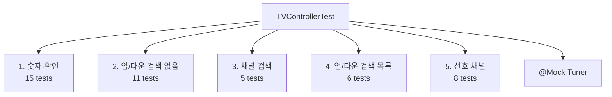

# TDD_TV_01 TVControllerTest 설계·구현 보고서

| 항목 | 내용 |
|------|------|
| 프로젝트 | TDD_TV_01 (TDD_TV Maven) |
| 작성자 | 김경림 |
| 작성일 | 2026-05-19 |
| 문서 유형 | TVController 통합 단위 테스트 설계·보강 보고서 |
| 상세 산출물 | [`src/test/java/com/bestreviewer/TVControllerTest.java`](../src/test/java/com/bestreviewer/TVControllerTest.java) |
| 기준 문서 | [`docs/03.test_plan.md`](../docs/03.test_plan.md), [`docs/01.requirements_analysis.md`](../docs/01.requirements_analysis.md), `README.md` |
| 선행 문서 | [`REPORT/03.TDD_TV_01_테스트계획_구현_보고서.md`](03.TDD_TV_01_테스트계획_구현_보고서.md) |
| 저장소 | https://github.com/antihu99/TDD_TV_01.git |

---

## 1. 보고서 개요

본 문서는 시니어 Java QA 관점에서 **`TVControllerTest`를 기능별·경계값 중심으로 재설계·보강**한 결과를 정리합니다.

| 목표 | 조치 | 결과 |
|------|------|------|
| 기능별 최소 5개 테스트 | `@Nested` 5개 영역, 영역별 5~15 메서드 | ✅ |
| Given–When–Then | 메서드 내 `// Given` / `// When` / `// Then` | ✅ |
| 경계값 포함 | 채널 0·1·98·99, 키 0·9, 순환 0↔99 | ✅ |
| ParameterizedTest | `@CsvSource` 업/다운·2자리·단일 숫자 | ✅ |
| 빌드 Green | `mvn test`, `mvn verify` | ✅ |

---

## 2. 작업 전·후 비교

### 2.1 `TVControllerTest` 구조

| 구분 | 03 보고서 시점 | 본 작업 후 |
|------|----------------|------------|
| 테스트 수 | 35건 (플랫 구조) | **45건** (`@Nested` 5영역) |
| 구조 | 단일 클래스·주석 섹션 | **`@Nested` 기능별 분리** |
| DisplayName | 규칙 ID + 한글 | **Given–When–Then** 형식 통일 |
| Parameterized | 일부 (`ValueSource`, `CsvSource`) | **경계 중심 `CsvSource` 확대** |
| 교차 시나리오 | X-01 등 일부 | **검색·버퍼·재검색(X-02~05) 추가** |

### 2.2 전체 테스트·빌드

| 구분 | 03 보고서 | 본 작업 후 |
|------|---------|------------|
| 총 단위 테스트 | 53건 | **63건** (Green) |
| `TVControllerTest` | 35 | **45** |
| `ChannelInputBufferTest` | 7 | 7 |
| `FavoriteChannelsTest` | 5 | 5 |
| `ChannelConstantsTest` | 6 | 6 |
| JaCoCo `verify` 게이트 | 통과 | **통과** (LINE ≥90%, BRANCH ≥85%) |

---

## 3. 테스트 설계 원칙

### 3.1 실행 표준 (`.cursorrules` · `docs/03.test_plan.md` §7)

| 원칙 | 적용 |
|------|------|
| Given–When–Then | 모든 신규·수정 메서드에 단계 주석 |
| `@DisplayName` | `"규칙ID: Given … — When … — Then …"` |
| 검증 | `Mockito.verify(tuner).setCH(...)` / `never()` — **로그 검증 없음** |
| 입력 | `pushButton(remoteKey.KEY_*)` — 키를 Given 데이터로 주입 |
| 상태 유지 | 업/다운·선호 시 `stubChannelTracking()` + `AtomicReference` |

### 3.2 `@Nested` 기능 분류



| `@Nested` 클래스 | 테스트 수 | README 기능 | 규칙 ID |
|-----------------|:---------:|-------------|---------|
| `NumberAndConfirm` | 15 | 숫자 버튼·확인 | N-01~07, OK-02, B-KEY, B-CH, B-INV-03 |
| `ChannelUpDownWithoutScan` | 11 | 업/다운 (검색 없음) | UD-01~04, B-CH-05/06, B-INV-04 |
| `ChannelSearch` | 5 | 채널 검색 | S-01~02, X-02~03, X-05 |
| `ChannelUpDownWithScan` | 6 | 업/다운 (검색 있음) | UD-05~08, B-CH-07a/b |
| `FavoriteChannel` | 8 | 선호·다음 선호 | P-01~04, F-01~02, X-01, B-CH-08 |

> ParameterizedTest 1메서드 = 다수 데이터 행이어도 **테스트 메서드 1건**으로 집계합니다.

---

## 4. 기능별 테스트 매트릭스

### 4.1 숫자·확인 (15건)

| ID | DisplayName 요약 | 검증 |
|----|------------------|------|
| N-01 | 1·확인 → 1번 | `setCH("1")` |
| N-02 | 1·2 → 12번 | `setCH("12")` |
| N-03 | 1·2·3·4 → 12, 34 | `InOrder` |
| N-04 | 4·5·6 → 45 | `setCH("45")` |
| N-05 | 456 후 확인 → 45, 6 | `InOrder` |
| N-06 | 456 후 업 → 45, 46 (6 무효) | `never("6")` |
| N-07 | 0·7 → 7 | `setCH("7")` |
| OK-02 | 빈 버퍼 확인 | `never(setCH)` |
| B-KEY | 0·1·9 + 확인 | `@CsvSource` ×3 |
| B-CH | 98·99 2자리 | `@CsvSource` 9,8 / 9,9 |
| B-KEY-05 | 99 후 확인 1회만 | `times(1)` |
| B-INV-03 | 99 후 9·확인 → 9 | `InOrder` 99→9 |

### 4.2 채널 업/다운 — 검색 없음 (11건)

| ID | 입력 (현재 → 기대) | 방식 |
|----|-------------------|------|
| UD-01/03 | 6→7, 99→0, 1→2, 98→99 | `@CsvSource` UP |
| UD-02/04 | 6→5, 0→99, 1→0, 98→97 | `@CsvSource` DOWN |
| B-CH-05 | 99 업 → 0 | 단일 `@Test` |
| B-CH-06 | 0 다운 → 99 | 단일 `@Test` |
| B-INV-04 | 버퍼 대기 중 다운 → 9 | 버퍼 클리어 검증 |

### 4.3 채널 검색 (5건)

| ID | 시나리오 | Then |
|----|----------|------|
| S-01 | seekCH 3회 반환 | `seekCH` ×3 |
| X-05 | 즉시 순환 (7→7) | `seekCH` ×1 |
| X-02 | 버퍼 4 + 검색 + OK | `setCH` never |
| X-03 | 검색 후 업 → 목록 14 (±1 아님) | `never("7")` |
| S-02 | 재검색 | `seekCH` ×6 (스텁 6값) |

### 4.4 채널 업/다운 — 검색 목록 (6건)

| ID | Given | Then |
|----|-------|------|
| UD-05 | 목록 4·6·14, ch=6, UP | `14` |
| UD-06 | 동일, DOWN | `4` |
| UD-07 | ch=15, UP | `4` |
| UD-08 | ch=15, DOWN | `14` |
| B-CH-07a | ch=98, UP | `99` |
| B-CH-07b | ch=99, UP | `98` (순환) |

### 4.5 선호 채널 (8건)

| ID | 시나리오 | Then |
|----|----------|------|
| P-01 | {1,4,12,56}, ch=6 | `12` |
| P-02 | ch=56 | `1` |
| F-01 | ch=6 추가 후 다음선호 | `6` |
| F-02 | ch=6 토글 제거 | `12`, `never("6")` |
| P-03 | 선호 1개 | `7` |
| P-04 | 선호 없음 | `never(setCH)` |
| B-CH-08 | 선호 {0,99}, ch=50 | `99` |
| X-01 | 버퍼 + 선호추가 + OK | `never(setCH)` |

---

## 5. 경계값 커버리지

요구 **C-01** (채널 0~99) 및 테스트 계획 §4 기준.

| 경계 | 검증 위치 | 방법 |
|------|-----------|------|
| **0** | N-07, B-KEY(0+OK), B-CH-06, B-CH-08 | 단일·순환·선호 |
| **1** | N-01, B-KEY, UD Parameterized | 확인·업 |
| **98** | B-CH Parameterized, B-CH-07a | 9+8, 검색 목록 UP |
| **99** | B-CH, B-KEY-05, B-INV-03, B-CH-05 | 9+9, 순환 UP |
| **0↔99** | UD `@CsvSource`, B-CH-05/06 | wrapChannel |

---

## 6. 실행 결과

### 6.1 Surefire 요약 (`mvn test`)

| 테스트 클래스 | 실행 | 실패 | 오류 |
|---------------|-----:|-----:|-----:|
| `ChannelConstantsTest` | 6 | 0 | 0 |
| `ChannelInputBufferTest` | 7 | 0 | 0 |
| `FavoriteChannelsTest` | 5 | 0 | 0 |
| `TVControllerTest` (Nested 합계) | 45 | 0 | 0 |
| **합계** | **63** | **0** | **0** |

```bash
mvn clean test    # 63 tests, BUILD SUCCESS
mvn clean verify  # JaCoCo 게이트 포함, BUILD SUCCESS
```

### 6.2 JaCoCo 라인 커버리지 (`mvn verify` 기준)

| 클래스 | Line Covered / Total | 비고 |
|--------|----------------------|------|
| `TVController` | 56 / 56 | 100% |
| `FavoriteChannels` | 13 / 13 | 100% |
| `ChannelConstants` | 1 / 1 | 100% |
| `ChannelInputBuffer` | 22 / 25 | 예외 분기 3라인 |
| `ScannedChannelList` | 27 / 29 | early return 2라인 |
| `remoteKey` | 23 / 24 | enum |

- 패키지 게이트: **LINE ≥ 90%**, **BRANCH ≥ 85%** — `All coverage checks have been met.`
- HTML: `target/site/jacoco/index.html`

---

## 7. 요구사항 추적

| README §TDD practice | 규칙 ID | `TVControllerTest` |
|----------------------|---------|:------------------:|
| 1. 숫자 버튼 | N-01~07, OK-02, B-* | ✅ 15건 |
| 2. 선호 추가 | F-01, F-02, X-01 | ✅ |
| 3. 다음 선호 | P-01~04, B-CH-08 | ✅ |
| 4. 채널 검색 | S-01~02, X-02~05 | ✅ |
| 5. 업/다운 (무검색) | UD-01~04, B-CH-05/06 | ✅ |
| 6. 업/다운 (검색) | UD-05~08, B-CH-07 | ✅ |

---

## 8. Mock 스텁 설계 노트

| 이슈 | 원인 | 해결 |
|------|------|------|
| S-02 재검색 4회만 호출 | `thenReturn` 3값 소진 후 `6` 반복 → 2차 스캔 즉시 종료 | `thenReturn` **6개** 값 제공 |
| B-CH-07 ch=99 → `0` | `seekCH` 첫 반환이 `99` → 스캔 0건 → 일반 UP | `98, 99` 순서로 스텁 분리 |
| P-04 | `getCurrentCH` 미스텁 시 NPE | `when(...).thenReturn("6")` |

---

## 9. 산출물 목록

| 파일 | 설명 |
|------|------|
| `REPORT/04.TDD_TV_01_TVControllerTest_설계_보고서.md` | 본 보고서 |
| `src/test/java/com/bestreviewer/TVControllerTest.java` | `@Nested` 45 시나리오 |
| `docs/03.test_plan.md` | 테스트 계획 (기준) |
| `target/surefire-reports/` | 실행 결과 (빌드 후) |
| `target/site/jacoco/index.html` | 커버리지 리포트 (빌드 후) |

---

## 10. 결론

`TVControllerTest`를 **기능 5영역 `@Nested` 구조**로 재편하고, README TDD practice 전 영역에 대해 **규칙 ID 단위 추적·경계값·ParameterizedTest**를 반영했습니다. 총 **63건** 단위 테스트가 Green이며, `mvn verify` JaCoCo 게이트도 유지됩니다.

향후 `ScannedChannelList`·`ChannelInputBuffer` 미커버 분기(§03 보고서 §9)는 별도 직접 단위 테스트로 보강할 수 있으며, Controller 회귀 방지의 1차 게이트는 본 `TVControllerTest`로 충분합니다.

---

*문의·수정: `docs/03.test_plan.md`, `REPORT/03.TDD_TV_01_테스트계획_구현_보고서.md`, `.cursorrules`*
