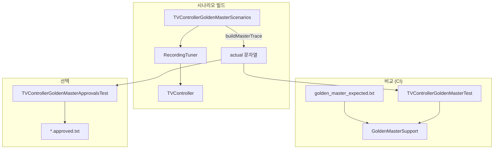

# TDD_TV_01 Golden Master 회귀 테스트 구현 보고서

| 항목 | 내용 |
|------|------|
| 프로젝트 | TDD_TV_01 (TDD_TV Maven) |
| 작성자 | 김경림 |
| 작성일 | 2026-05-19 |
| 문서 유형 | Golden Master(Approval) 회귀 테스트 설계·구현·CI 연동 보고서 |
| 상세 산출물 | [`docs/04.Golden_Master.md`](../docs/04.Golden_Master.md) |
| 테스트 계획 반영본 | [`docs/03.test_plan_new.md`](../docs/03.test_plan_new.md) (§4 Golden Master) |
| 선행 문서 | [`REPORT/04.TDD_TV_01_TVControllerTest_설계_보고서.md`](04.TDD_TV_01_TVControllerTest_설계_보고서.md) |
| 저장소 | https://github.com/antihu99/TDD_TV_01.git |

---

## 1. 보고서 개요

본 문서는 **Golden Master 회귀 테스트**를 설계·구현하고, baseline 파일 보관·비교·CI 자동 실행까지 연동한 결과를 정리합니다.

| 단계 | 내용 | 산출물 |
|------|------|--------|
| 1 | Golden Master 목적·아키텍처·트레이스 형식 정의 | `docs/04.Golden_Master.md` |
| 2 | `RecordingTuner` + 시나리오 직렬화 + 비교 유틸 구현 | 테스트 소스 5종 |
| 3 | baseline `golden_master_expected.txt` 생성·Git 보관 | `src/test/resources/golden_master/` |
| 4 | CI에서 `mvn test` 자동 실행 | `.github/workflows/ci.yml` |
| 5 | (선택) ApprovalTests 승인 파일 방식 | `*.approved.txt` |
| 6 | 테스트 계획서 §4 반영 | `docs/03.test_plan_new.md` |

---

## 2. 작업 전·후 비교

### 2.1 회귀 테스트 현황

| 구분 | 04 보고서 시점 | 본 작업 후 |
|------|----------------|------------|
| 회귀 방식 | `TVControllerTest` Mockito 단위 검증만 | **단위 + Golden Master 트레이스** 이중 게이트 |
| 통합 트레이스 | 없음 | 17개 핵심 시나리오 → 1개 baseline 문자열 |
| baseline 파일 | 없음 | `golden_master_expected.txt` (100줄) |
| CI | (계획) | GitHub Actions `mvn -B test` |
| ApprovalTests | pom 의존성만 존재 | 승인 테스트 1건 Green |

### 2.2 테스트·빌드 수치

| 구분 | 04 보고서 | 본 작업 후 |
|------|---------|------------|
| 총 단위·회귀 테스트 | 63건 | **66건** (Green) |
| Golden Master 전용 | 0 | **3건** (GM-01, GM-02, GM-A01) |
| `mvn test` | Green | **Green** |
| `mvn verify` (JaCoCo) | 통과 | **통과** (기존 게이트 유지) |

---

## 3. 설계 요약

### 3.1 단위 테스트 vs Golden Master

| 구분 | `TVControllerTest` | Golden Master |
|------|-------------------|---------------|
| 검증 단위 | 규칙 ID별 Given–When–Then | §3 매트릭스 **핵심 17 시나리오** 일괄 |
| 검증 수단 | `verify(tuner).setCH(...)` | `RecordingTuner` **전체 호출 트레이스** |
| 회귀 탐지 | 개별 assertion 실패 | baseline 문자열 diff (첫 불일치 줄) |
| 갱신 | 테스트 메서드 수정 | `-Dgolden.master.update=true` (의도적 변경 시) |

### 3.2 아키텍처



### 3.3 트레이스 형식

| 줄 패턴 | 의미 |
|---------|------|
| `### N-01: ...` | 시나리오 ID·한글 설명 (`TVControllerTest` DisplayName과 동일 ID) |
| `# initial_ch=0` | 시나리오 시작 채널 |
| `# setup_ch=6` | Given 준비(선호 등록·검색 전 채널) |
| `setCH(12)` | `Tuner.setCH` 호출 |
| `seekCH() -> 14` | `Tuner.seekCH` 호출·반환 |
| `# final_ch=12` | 시나리오 종료 채널 |

---

## 4. 구현 상세

### 4.1 테스트·지원 클래스

| 클래스 | 패키지 | 역할 |
|--------|--------|------|
| `RecordingTuner` | `com.bestreviewer` | Fake Tuner — 상태 유지 + 호출 기록 |
| `TVControllerGoldenMasterScenarios` | `com.bestreviewer` | 17개 섹션 트레이스 생성 |
| `GoldenMasterSupport` | `com.bestreviewer.golden` | 로드·정규화·diff·repo 갱신 |
| `TVControllerGoldenMasterTest` | `com.bestreviewer` | classpath baseline 비교 (GM-01, GM-02) |
| `TVControllerGoldenMasterApprovalsTest` | `com.bestreviewer` | ApprovalTests 승인 (GM-A01) |

### 4.2 Golden Master 시나리오 매핑

| ID | 설명 | `TVControllerTest` 영역 |
|----|------|-------------------------|
| N-01 ~ N-07 | 숫자·확인·버퍼 | `NumberAndConfirm` |
| OK-02 | 빈 버퍼 + 확인 | `NumberAndConfirm` |
| UD-01, UD-03, UD-04 | 업/다운 (검색 없음) | `ChannelUpDownWithoutScan` |
| S-01 | 검색 seek 3회 | `ChannelSearch` |
| X-05, X-02 | 검색 특이 | `ChannelSearch` |
| UD-05 | 검색 목록 기준 업 | `ChannelUpDownWithScan` |
| P-01, P-04, F-02 | 선호 채널 | `FavoriteChannel` |

> Parameterized 경계(UD-02 등)·`ChannelInputBuffer` 직접 테스트는 Golden Master 범위 밖 — 단위 테스트로 유지.

### 4.3 `RecordingTuner` 동작

- `setInitialChannel` / `prepareChannel`: 트레이스에 `# initial_ch`, `# setup_ch` 기록
- `enqueueSeekResponses`: 검색 시 `seekCH` 반환값 큐
- `setCH` / `seekCH`: 호출마다 `setCH(n)`, `seekCH() -> n` 추가
- `appendFinalChannel`: 섹션 종료 시 `# final_ch` 기록

---

## 5. baseline 생성·비교·갱신

### 5.1 보관 위치

| 용도 | 경로 |
|------|------|
| Git 소스 (baseline) | `src/test/resources/golden_master/golden_master_expected.txt` |
| 테스트 classpath | `/golden_master/golden_master_expected.txt` |
| 갱신 대상 (update 모드) | `GoldenMasterSupport.REPO_RELATIVE_PATH` → 위 repo 경로 |

### 5.2 비교 로직 (`GoldenMasterSupport`)

1. `actual` / `expected` CRLF → LF 정규화
2. 문자열 전체 `equals` 비교
3. 불일치 시 **첫 번째 다른 줄 번호** + expected/actual 해당 줄 출력
4. 실패 메시지에 baseline 갱신 명령 포함

### 5.3 갱신 명령 (의도적 동작 변경 후)

```bash
# Windows PowerShell
mvn test "-Dtest=TVControllerGoldenMasterTest" "-Dgolden.master.update=true"

# Linux / macOS / CI 로컬
mvn test -Dtest=TVControllerGoldenMasterTest -Dgolden.master.update=true
```

**운영 원칙**: 테스트 실패를 baseline 덮어쓰기로 해결하지 않는다. diff 리뷰 후 커밋.

---

## 6. CI 연동

### 6.1 GitHub Actions

| 항목 | 설정 |
|------|------|
| 워크플로 | `.github/workflows/ci.yml` |
| 트리거 | `main` / `master` push, PR |
| JDK | 21 (Temurin) |
| 명령 | `mvn -B test` |
| Golden Master | 별도 프로필 없음 — **기본 Surefire에 포함** |

### 6.2 로컬 실행

```bash
mvn test                                    # 전체 66건 (Golden Master 포함)
mvn test -Dtest=TVControllerGoldenMasterTest   # GM만
mvn verify                                  # JaCoCo 게이트 포함
```

---

## 7. (선택) ApprovalTests

| 항목 | 내용 |
|------|------|
| 의존성 | `approvaltests` 4.0.2 (`pom.xml`, test scope) |
| 테스트 | `TVControllerGoldenMasterApprovalsTest.masterTraceApproved` |
| 승인 파일 | `TVControllerGoldenMasterApprovalsTest.masterTraceApproved.approved.txt` |
| 실패 시 | `.received.txt` 생성 → diff 후 승인 |

**권장**: 팀 baseline은 **리소스 Golden Master 1개**만 CI 게이트로 사용. Approvals는 IDE 승인 UX·학습용으로 유지하거나 `@Disabled`로 이중 관리 부담을 줄인다.

---

## 8. 테스트 실행 결과

`mvn test` 기준 (2026-05-19).

### 8.1 Golden Master·전체

| 테스트 클래스 | 건수 | 결과 |
|---------------|:----:|:----:|
| `TVControllerGoldenMasterTest` | 2 | Green |
| `TVControllerGoldenMasterApprovalsTest` | 1 | Green |
| `TVControllerTest` (`@Nested` 합계) | 45 | Green |
| 기타 (`ChannelInputBufferTest` 등) | 18 | Green |
| **합계** | **66** | **Green** |

### 8.2 Golden Master 테스트 케이스

| ID | DisplayName | 검증 내용 |
|----|-------------|-----------|
| GM-01 | 마스터 트레이스 ↔ baseline 일치 | `assertMatchesGolden` |
| GM-02 | baseline 파일 비어 있지 않음 | CI 누락 방지 |
| GM-A01 | ApprovalTests 승인 | `Approvals.verify(actual)` |

### 8.3 baseline 샘플 (N-01)

```text
### N-01: 1·확인 → 1번
# initial_ch=0
setCH(1)
# final_ch=1
```

전체 17개 섹션·100줄: `src/test/resources/golden_master/golden_master_expected.txt`

---

## 9. 요구사항·테스트 추적

| README 기능 | 규칙 ID (Golden Master) | 단위 테스트 | Golden Master |
|-------------|-------------------------|:-----------:|:-------------:|
| 숫자 버튼 | N-01 ~ N-07 | ✅ | ✅ |
| 확인·빈 버퍼 | OK-02 | ✅ | ✅ |
| 업/다운 (무검색) | UD-01,03,04 | ✅ | ✅ |
| 채널 검색 | S-01, X-05, X-02 | ✅ | ✅ |
| 업/다운 (검색) | UD-05 | ✅ | ✅ |
| 선호 채널 | P-01, P-04, F-02 | ✅ | ✅ |

---

## 10. 문서·산출물 목록

| 파일 | 설명 |
|------|------|
| `docs/04.Golden_Master.md` | Golden Master 설계·운영 상세 |
| `docs/03.test_plan_new.md` | 테스트 계획서 + §4 Golden Master |
| `REPORT/06.TDD_TV_01_Golden_Master_구현_보고서.md` | 본 보고서 |
| `src/test/resources/golden_master/golden_master_expected.txt` | baseline |
| `src/test/java/.../RecordingTuner.java` | 트레이스 기록 Fake |
| `src/test/java/.../TVControllerGoldenMasterScenarios.java` | 시나리오 빌더 |
| `src/test/java/.../golden/GoldenMasterSupport.java` | 비교·갱신 유틸 |
| `src/test/java/.../TVControllerGoldenMasterTest.java` | 파일 Golden Master |
| `src/test/java/.../TVControllerGoldenMasterApprovalsTest.java` | ApprovalTests |
| `src/test/java/.../*.approved.txt` | Approvals 승인 파일 |
| `.github/workflows/ci.yml` | CI `mvn test` |

---

## 11. 잔여 이슈·향후 작업

| 항목 | 설명 | 권장 |
|------|------|------|
| `03.test_plan.md` 통합 | `03.test_plan_new.md`가 §4 반영본 | 검토 후 `03.test_plan.md` 교체 |
| baseline 이중 관리 | 리소스 `.txt` + `.approved.txt` | CI는 리소스만 게이트 |
| 시나리오 확장 | UD-02 등 Parameterized | §3 갭 해소 시 GM 섹션 추가·갱신 |
| Git 추적 | Golden Master 산출물 untracked 가능 | `src/test/resources`, `.github/workflows` 커밋 |
| Java 21 pom | CI 21 vs pom 1.8 | toolchain 정합 (03·04 보고서 공통 이슈) |

---

## 12. 결론

`TVController` 핵심 시나리오 17개를 **결정적 텍스트 트레이스**로 직렬화하고, `golden_master_expected.txt`와 비교하는 Golden Master 회귀 테스트를 구현했습니다. `mvn test`에 포함되어 **CI에서 자동 검증**되며, 의도적 변경 시에만 update 모드로 baseline을 갱신하는 운영 절차를 문서화했습니다.

단위 테스트(`TVControllerTest` 45건)와 Golden Master(3건)를 함께 사용하면, 리팩터링 시 **개별 규칙 검증**과 **통합 튜너 계약 회귀**를 이중으로 방어할 수 있습니다. 상세 운영·명령은 [`docs/04.Golden_Master.md`](../docs/04.Golden_Master.md)를 참조합니다.

---

*문의·수정: `docs/04.Golden_Master.md`, `docs/03.test_plan_new.md`, `REPORT/04.TDD_TV_01_TVControllerTest_설계_보고서.md` 참조*
