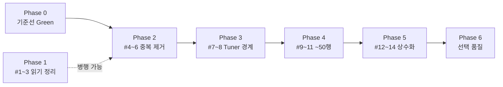
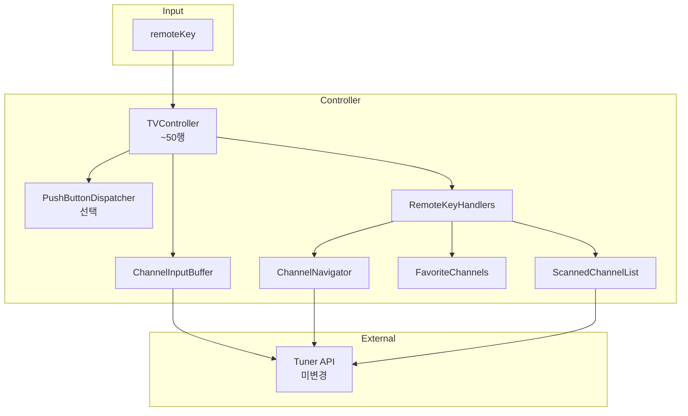

# TDD_TV_01 TVController 점진적 리팩토링 계획 보고서

| 항목 | 내용 |
|------|------|
| 프로젝트 | TDD_TV_01 (TDD_TV Maven) |
| 작성자 | 김경림 |
| 작성일 | 2026-05-19 |
| 문서 유형 | Martin Fowler 스타일 점진적 리팩토링 계획 (코칭·로드맵) |
| 분석 대상 | [`src/main/java/com/bestreviewer/TVController.java`](../src/main/java/com/bestreviewer/TVController.java) |
| 기준 문서 | [`docs/02.code_quality_report.md`](../docs/02.code_quality_report.md), [`docs/01.requirements_analysis.md`](../docs/01.requirements_analysis.md) |
| 선행 문서 | [`REPORT/02.TDD_TV_01_코드품질_구현_보고서.md`](02.TDD_TV_01_코드품질_구현_보고서.md) |
| 저장소 | https://github.com/antihu99/TDD_TV_01.git |

---

## 1. 보고서 개요

본 문서는 **이미 Green인 `TVController`를 유지한 채**, Martin Fowler 리팩토링 원칙에 따라 **커밋 단위로 쪼갠 2차 리팩토링 로드맵**을 정리합니다.

| 제약 | 내용 |
|------|------|
| `Tuner` | **수정 금지** (외부 API) |
| `TVController` 목표 | **~50행 이하**의 얇은 오케스트레이터 (현재 114행) |
| 진행 조건 | **`mvn test` Green에서만** 다음 단계 진행 |
| 범위 | 구조·가독성·중복 제거 (기능 추가와 분리) |

| 단계 | 내용 | 산출물 |
|------|------|--------|
| 0 | 현재 상태 진단·기준선 | 본 문서 §2 |
| 1 | Phase 1~2: 읽기 정리·중복 제거 | `TVController` 내부 정리 |
| 2 | Phase 3~4: Extract Class·~50행 | `ChannelNavigator`, `TunerChannel` 등 |
| 3 | Phase 5~6: 매직 넘버·선택 품질 | 협력 클래스 상수화 |

> **참고**: [`REPORT/02`](02.TDD_TV_01_코드품질_구현_보고서.md)에서 1차 리팩토링(버퍼·핸들러·상수 분리)은 **이미 완료**되었습니다. 본 문서는 **2차(잔여) 개선** 계획입니다.

---

## 2. 현재 상태 진단

### 2.1 1차 리팩토링 이행 현황 (`docs/02.code_quality_report.md` 대비)

| 우선순위 | 계획 | 상태 |
|:---:|------|:----:|
| 1 | `tuner.setCH` 연동, 로그 제거 | ✅ |
| 2 | 숫자 0~9 공통 처리 | ✅ |
| 3 | `ChannelInputBuffer` 추출 | ✅ |
| 4 | `RemoteKeyHandler` + `EnumMap` | ✅ |
| 5 | `ChannelConstants` (0~99) | ✅ |

### 2.2 현재 소스 구조

```
src/main/java/com/bestreviewer/
├── TVController.java          # 114행 — 리모컨 디스패치·업다운·핸들러 등록
├── ChannelInputBuffer.java    # 숫자 버퍼·2자리 자동 확정
├── ChannelConstants.java      # MIN/MAX·isValid
├── FavoriteChannels.java      # 선호 토글·다음 선호
├── ScannedChannelList.java    # 검색 목록·목록 기준 업/다운
├── RemoteKeyHandler.java      # @FunctionalInterface
├── remoteKey.java
└── Tuner.java                 # 미변경 (외부 API)
```

### 2.3 잔여 Code Smell (2차 대상)

| 스멜 | 위치 | 설명 |
|------|------|------|
| **Duplicated Code** | `channelUp` / `channelDown` | 동일 구조, 부호·메서드명만 상이 (각 6행) |
| **Duplicated Code** | `channelUp`/`channelDown` vs `applyChannel` | `tuner.setCH(String.valueOf(...))` — 업/다운은 `applyChannel` 미사용 |
| **Feature Envy** | `wrapChannel` | 채널 범위 규칙은 `ChannelConstants`에 더 가깝음 |
| **Duplicated Code** | `getCurrentChannel`, `ScannedChannelList.parseChannel` | `Integer.parseInt(tuner.getCurrentCH())` 패턴 반복 |
| **Large Class (잔류)** | `TVController` | 협력 객체 분리 후에도 업/다운·wrap·핸들러 팩토리 잔존 |
| **Magic Number (잔류)** | `ChannelInputBuffer` | `2` (2자리 flush), `ScannedChannelList` | `100` (스캔 상한) |

### 2.4 `pushButton` 흐름 (유지 대상)

요구사항·Golden Master와 정합되는 진입점으로, **아래 17행 구조는 리팩토링 후에도 보존**합니다.

```
숫자 키?  → channelBuffer.appendDigit()
KEY_OK?   → confirmChannelFromBuffer()
기타 키?  → channelBuffer.clear() → keyHandlers.get(key).handle()
```

---

## 3. 전략 패턴·인터페이스 적용 가능성

| 영역 | 현재 구현 | Fowler 관점 | 권장 |
|------|-----------|-------------|------|
| 비숫자 키 | `RemoteKeyHandler` + `EnumMap` | **Strategy (적용 완료)** | 유지. 키마다 클래스 5개 분리는 과설계 |
| 숫자 키 | `isDigitKey()` + `ChannelInputBuffer` | 콜백(Consumer) | 유지 |
| 업/다운 | `channelUp` / `channelDown` | Strategy **후보** | 우선 **Combine Methods** → 필요 시 `ChannelNavigator` |
| 채널 순환 | `wrapChannel` (private static) | **Move Method** | `ChannelConstants.wrap(int)` |
| Tuner 연동 | `getCurrentChannel` / `applyChannel` | **Extract Class** | `TunerChannel` (Tuner 미수정) |

**원칙**: *Replace Conditional with Polymorphism*은 **switch가 비대해질 때** 유효합니다. 현재 `EnumMap` 핸들러는 OCP를 이미 충족하므로, 추가 Strategy 클래스는 **ROI가 낮을 때 보류**합니다.

---

## 4. 단계별 리팩토링 계획

### 4.0 Phase 0 — 기준선 고정

| # | 작업 | 체크리스트 | 검증 |
|---|------|------------|------|
| 0 | Green 스냅샷 확인 | `git status` 정리, 실패 테스트 없음 | `mvn test` |

```bash
mvn test
# 기대: BUILD SUCCESS, Failures: 0, Errors: 0
```

---

### 4.1 Phase 1 — 읽기 전용 정리 (TVController 내부)

| # | Fowler 기법 | 작업 | 완료 체크 | 검증 |
|---|-------------|------|-----------|------|
| 1 | Rename Method | `confirmChannelFromBuffer` → `confirmBufferedChannel` | 호출부·테스트 컴파일 | `mvn test -Dtest=TVControllerTest` |
| 2 | 정리 | `createKeyHandlers` 등록 순서·주석 정리 (동작 동일) | diff 동작 무변 | `mvn test` |
| 3 | Reorder Members | 필드 → 생성자 → public → package → private | diff 재배치만 | `mvn test` |

**권장 커밋 메시지**: `refactor: rename confirmChannelFromBuffer for clarity`

---

### 4.2 Phase 2 — 중복 제거 (ROI 최우선)

| # | Fowler 기법 | 작업 | 완료 체크 | 검증 |
|---|-------------|------|-----------|------|
| 4 | Combine Methods | `channelUp`/`channelDown` → `changeChannel(int delta)` 또는 `Direction` enum | UD-01~08 동일 | `mvn test` |
| 5 | Extract Method | `resolveNextChannel(current, up)` — 검색 유무 분기 한 곳 | 업/다운 단일 경로 | `mvn test` |
| 6 | Move Method | `wrapChannel` → `ChannelConstants.wrap(int)` | 0↔99 순환 동일 | `mvn test` (+ `ChannelConstantsTest` 보강 선택) |

**4번 목표 코드 (동작 동일, 개념 예시)**:

```java
void changeChannel(int delta) {
    int current = getCurrentChannel();
    int next = scannedChannels.isEmpty()
            ? ChannelConstants.wrap(current + delta)
            : (delta > 0
                ? scannedChannels.channelUp(current)
                : scannedChannels.channelDown(current));
    applyChannel(next);
}
```

**6번 부가 효과**: `channelUp`/`channelDown`이 `applyChannel`을 사용하게 되어 `setCH` 호출 경로가 **단일화**됩니다.

**권장 커밋 메시지**:

- `refactor: combine channelUp and channelDown into changeChannel`
- `refactor: move wrapChannel to ChannelConstants`

---

### 4.3 Phase 3 — Tuner 경계 캡슐화 (`Tuner` 미수정)

| # | Fowler 기법 | 작업 | 완료 체크 | 검증 |
|---|-------------|------|-----------|------|
| 7 | Extract Class | `TunerChannel`: `read(Tuner)`, `apply(Tuner, int)` | `getCurrentChannel`/`applyChannel` 제거 또는 위임 | `mvn test` |
| 8 | Extract Method (static) | `ChannelParser.parse(String)` — `ScannedChannelList`와 파싱 통합 | 파싱 한 곳 | `mvn test` |

**롤백 기준**: 7번 Extract Class가 diff 대비 이득이 작으면 **8번만 적용**하고 7번은 보류합니다.

---

### 4.4 Phase 4 — TVController ~50행 목표

| # | Fowler 기법 | 작업 | 완료 체크 | 검증 |
|---|-------------|------|-----------|------|
| 9 | Extract Class | `ChannelNavigator` — wrap·검색 유무 업/다운 | `TVController`에서 업/다운 로직 이전 | `mvn test` |
| 10 | Move Method | `createKeyHandlers()` → `RemoteKeyHandlers.create()` | 생성자 3~4줄 수준 | `mvn test` |
| 11 | Extract Class (선택) | `PushButtonDispatcher` — digit/OK/기타 3분기만 | `pushButton` ≤10줄 | `mvn test` + Golden Master |

**목표 `TVController` 역할**:

| 책임 | 유지 | 이전 대상 |
|------|:----:|-----------|
| `pushButton` 라우팅 | ✅ | — |
| 협력 객체 조립 (생성자) | ✅ | 핸들러 팩토리 → #10 |
| 핸들러용 thin delegate | ✅ | 업/다운 → #9 |
| wrap·파싱·setCH 세부 | ❌ | #6~#9 |

**11번 보류 조건**: Phase 4 #9~#10만으로 **50행 이하** 달성 시 `PushButtonDispatcher`는 **YAGNI**로 생략합니다.

---

### 4.5 Phase 5 — 매직 넘버·가독성 (협력 클래스)

| # | 위치 | 작업 | 완료 체크 | 검증 |
|---|------|------|-----------|------|
| 12 | `ChannelInputBuffer` | `2` → `ChannelConstants.DIGITS_PER_PAIR` (또는 동등 상수) | N-02~N-07 | `mvn test -Dtest=ChannelInputBufferTest` |
| 13 | `ScannedChannelList` | `MAX_SCAN_ATTEMPTS` 의미 주석·`MAX_CHANNEL` 연계 | S-01 | `mvn test` |
| 14 | `remoteKey` (선택) | `KEY_OK` → `key.isConfirmKey()` | OK-01, OK-02 | `mvn test` |

---

### 4.6 Phase 6 — 선택적 품질 (요구 확정 후)

| # | 작업 | 조건 | 검증 |
|---|------|------|------|
| 15 | F-01/F-02 선호 토글 단독 테스트 | 내부 상태 노출 없이 시나리오로 | `mvn test` |
| 16 | `9`,`9`+확인 → 99 | README 경계 확정 후 | Red → Green → 리팩토링 |
| 17 | `package-private` 가시성 정리 | 테스트 패키지 동일 시 유지 가능 | — |

---

## 5. 단계별 검증 방법

### 5.1 표준 명령

| 목적 | 명령 |
|------|------|
| **전체 회귀 (필수, 매 단계)** | `mvn test` |
| Controller 빠른 확인 | `mvn test -Dtest=TVControllerTest` |
| Golden Master | `mvn test -Dtest=TVControllerGoldenMasterTest,TVControllerGoldenMasterApprovalsTest` |
| 버퍼·상수 단위 | `mvn test -Dtest=ChannelInputBufferTest,ChannelConstantsTest` |
| 커버리지 게이트 (선택) | `mvn verify` |

### 5.2 실패 시 대응 (Fowler 규칙)

1. 해당 커밋 **Revert**
2. 단계를 **더 작게** 분할 (예: Combine Methods 전에 `applyChannel` 통합만)
3. Green 복구 후 다음 단계 진행

### 5.3 커밋 게이트 체크리스트

- [ ] `mvn test` BUILD SUCCESS
- [ ] `git diff`에 **의도하지 않은 동작 변경** 없음
- [ ] Golden Master 테스트 실패 없음
- [ ] `Tuner.java` diff 없음

---

## 6. 우선순위 로드맵



| 순위 | Phase | 이유 |
|:---:|-------|------|
| **즉시** | 2 (#4~6) | diff 작음, 중복·`setCH` 경로 단일화 효과 큼 |
| **다음** | 3 (#7~8) | Tuner 미수정 하에 파싱 중복 제거 |
| **그 다음** | 4 (#9~10) | ~50행 목표의 핵심 |
| **보류 가능** | 4 (#11), 6 | YAGNI·요구 미확정 |

---

## 7. 목표 아키텍처 (2차 리팩토링 완료 시)



---

## 8. 하지 말아야 할 것

| 항목 | 이유 |
|------|------|
| `Tuner.java` 수정 | 외부 API·프로젝트 제약 |
| Red 상태에서 리팩토링 | Fowler: 먼저 Green, 그다음 구조 변경 |
| 한 커밋에 Extract Class 다수 | 되돌리기 어려움, 원인 분리 불가 |
| 키마다 Handler 클래스 5개+ | 현 `EnumMap`보다 복잡도만 증가 |
| 기능 추가와 리팩토링 혼합 | 커밋·리뷰·회귀 추적 어려움 |

---

## 9. 산출물·추적

| 파일 | 역할 |
|------|------|
| 본 문서 | 2차 리팩토링 로드맵·체크리스트 |
| [`docs/02.code_quality_report.md`](../docs/02.code_quality_report.md) | 1차 분석 원본 |
| [`REPORT/02.TDD_TV_01_코드품질_구현_보고서.md`](02.TDD_TV_01_코드품질_구현_보고서.md) | 1차 리팩토링·구현 완료 보고 |
| [`docs/01.requirements_analysis.md`](../docs/01.requirements_analysis.md) | 규칙 ID (N-, UD-, S-, P-) |

**진행 기록 권장**: Phase 완료 시 본 문서 §4 표의 「완료 체크」열에 ✅ 표시 또는 별도 `REPORT/07_진행로그.md` 추가.

---

## 10. 결론

`TVController`는 1차 리팩토링으로 **SRP·OCP·매직 넘버·버퍼 캡슐화**가 이미 달성되었고, 전체 테스트는 **Green** 상태입니다.  
2차 계획은 **동작을 바꾸지 않고** `channelUp`/`channelDown` 통합, `wrapChannel` 이동, `ChannelNavigator` 추출을 통해 **~50행의 얇은 Controller**를 만드는 것입니다.

**권장 착수**: Phase 2 #4 (`channelUp`/`channelDown` → `changeChannel`) — 커밋 1개, `mvn test` 게이트 통과 후 순차 진행.

---

*문의·수정: `README.md`, `docs/01.requirements_analysis.md`, `docs/02.code_quality_report.md`, `.cursorrules` 참조*
